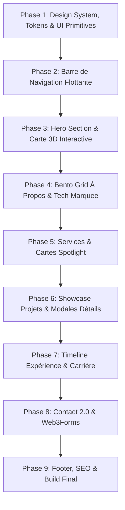

# 🚀 Plan Stratégique de Refonte Complète du Portfolio (Édition 2026)

Ce plan détaille la feuille de route pour la refonte complète et la modernisation du portfolio de **Jean-Claude Sassou** (`johnnygoldsoft.github.io`).

---

## 🎯 1. Vision & Objectifs Clés

1. **Esthétique Ultra-Moderne & Effet "Wow"** :
   - Design épuré, premium, aux standards 2025/2026 (Bento Grids, Glassmorphism, bordures lumineuses, effets Spotlight interactifs).
   - Finitions Dark Mode ("Deep OLED Slate") et Light Mode ("Clean Frost") soignées avec switch fluide.
2. **Expérience Utilisateur Interactive & Micro-Animations** :
   - Animations Framer Motion fluides au défilement (*scroll reveal*), parallaxe souris, boutons magnétiques, filtres animés.
3. **Qualité Technique & Performance** :
   - Next.js 15 App Router avec Turbopack, Tailwind CSS v4, composants UI atomiques et modulaires.
   - Suppression des PNGs basse définition au profit d'icônes vectorielles nettes (SVG / `lucide-react`).
   - SEO complet, OpenGraph et Core Web Vitals optimisés.

---

## 🗺️ 2. Roadmap & Phases de Mise en Œuvre

---

## 📋 3. Détail des Phases de Développement

### 🔹 Phase 1 : Design System, Tokens & Composants Atomiques
- **Variables CSS & Thème** : Définition des tokens de couleurs HSL/Hex, rayons de courbure, ombres néon et flous d'arrière-plan dans `src/app/globals.css`.
- **Typographie** : Configuration des polices Google modernes (*Outfit* / *Inter* pour les titres et corps, police monospace pour les badges techniques).
- **Icônes vectorielles** : Intégration d'icônes SVG nettes et légères.
- **Composants Primitives** :
  - `Button` : Variantes enrichies (Glow Primary, Ghost, Outline, Magnetic, avec spinner intégré).
  - `SpotlightCard` : Carte interactive avec reflet radial suivant la position de la souris.
  - `Badge` & `Tag` : Puces de compétences et de statuts de projets.
  - `Modal` / `Drawer` : Modale accessible pour l'affichage approfondi des projets.

### 🔹 Phase 2 : Navigation Flottante Intelligente ("Floating Pill")
- **Navbar en îlot flottant** :
  - Style pilule semi-transparente avec `backdrop-blur-xl` et bordure subtile.
  - Détection automatique de la section visible à l'écran (*Active Section Spy*).
  - Indicateur de défilement fin (*Scroll Progress Bar*) en haut de page.
  - Switch Dark/Light animé sans scintillement (FOUC).
  - Menu mobile moderne en panneau rétractable avec animations échelonnées.

### 🔹 Phase 3 : Hero Section Captivante & Carte 3D
- **Badge de disponibilité** : `🟢 Disponible pour nouveaux projets • Freelance & CDI`.
- **Titre & Rôles dynamiques** : Effet de dégradé animé et rotation de spécialités (*Full-Stack Developer*, *Flutter Mobile Engineer*, *UI/UX Designer*).
- **Carte Profil 3D** : Effet de parallaxe au survol avec halo lumineux d'ambiance.
- **Appels à l'action rapides** :
  - *Explorer les projets 🚀* (défilement fluide vers la section).
  - *Télécharger le CV 📄* (lien direct sécurisé).
  - *Me contacter ✉️*.

### 🔹 Phase 4 : Section "À Propos" sous forme de Bento Grid
- **Bento Grid interactif** (standard des portfolios haut de gamme) :
  - **Bloc 1 (Bio Principale)** : Parcours, philosophie d'ingénierie et vision.
  - **Bloc 2 (Infinite Tech Marquee)** : Bandeau défilant infini avec les logos des technologies maîtrisées.
  - **Bloc 3 (Statistiques Clés)** : Chiffres clés animés (Années d'expérience, projets achevés, clients/contributions).
  - **Bloc 4 (Localisation & Timezone)** : Widget interactif (Lomé, Togo • GMT/UTC • Télétravail ouvert).
  - **Bloc 5 (Formation & Certifications)** : Parcours académique et diplômes.

### 🔹 Phase 5 : Section "Services" & Valeur Métier
- Grille de cartes de services interactives avec effet *Spotlight*.
- Cartes détaillant :
  - 🌐 *Développement Web Full-Stack (Next.js, React, Tailwind CSS)*
  - 📱 *Applications Mobiles Cross-Platform (Flutter, Dart, Firebase)*
  - 🎨 *Design d'Interface & Expérience Utilisateur (Figma, Design System)*
  - ⚙️ *Architectures Backend, Bases de Données & APIs (Laravel, Node, SQL/NoSQL)*
  - 🖥️ *Infrastructure, Réseaux & Maintenance Systèmes*
- Liste à puces des garanties incluses (Responsive, Code propre, Performances, SEO).

### 🔹 Phase 6 : Showcase de Projets & Études de Cas
- **Onglets de filtrage avec animations fluides** (`layoutId` Framer Motion).
- **Cartes Projets Rehaussées** :
  - Mockups haute fidélité avec effet zoom au hover.
  - Badges technologiques spécifiques pour chaque projet.
  - Boutons d'action : *Démo Live ↗*, *Dépôt GitHub ↗*, *Étude de cas 🔍*.
  - Modale interactive détaillée (Contexte, défis, solution, galerie d'écrans).

### 🔹 Phase 7 : Timeline d'Expérience & Carrière *(Nouveau)*
- Frise chronologique verticale interactive illustrant les étapes clés du parcours académique et professionnel.

### 🔹 Phase 8 : Formulaire de Contact & Canaux Directs
- Disposition en 2 colonnes ergonomique :
  - **Colonne de gauche** : Coordonnées, bouton "Copier l'email en 1 clic", réseaux sociaux, fuseau horaire et temps de réponse moyen.
  - **Colonne de droite** : Formulaire ultra-moderne avec validation en direct, état de chargement et notification de succès via l'API Web3Forms.

### 🔹 Phase 9 : Footer & Finitions Premium
- Footer épuré avec heure locale dynamique, statut du site, copyright et bouton flottant de retour en haut.
- Métadonnées SEO enrichies (OpenGraph, Twitter Cards, Schema.org).
- Custom scrollbar et sélection de texte personnalisée.

---

## 📁 4. Inventaire des Fichiers Concernés

| Statut | Fichier | Description de l'intervention |
| :--- | :--- | :--- |
| `[NOUVEAU]` | `src/components/ui/SpotlightCard.jsx` | Carte interactive avec lueur radiale suivant la souris |
| `[NOUVEAU]` | `src/components/ui/Modal.jsx` | Modale accessible pour l'exploration des projets |
| `[NOUVEAU]` | `src/components/common/BentoGrid.jsx` | Grille Bento modulaire pour la section À Propos |
| `[NOUVEAU]` | `src/components/common/TechMarquee.jsx` | Bandeau défilant infini des technologies |
| `[NOUVEAU]` | `src/components/common/ExperienceTimeline.jsx` | Timeline interactive de carrière |
| `[MODIFIER]` | `src/app/globals.css` | Nouveaux tokens, variables de thème et animations |
| `[MODIFIER]` | `src/app/layout.js` | Métadonnées SEO, polices optimisées, structure globale |
| `[MODIFIER]` | `src/app/page.js` | Assemblage et orchestration des nouvelles sections |
| `[MODIFIER]` | `src/app/components/Navbar.jsx` | Refonte en Floating Island avec détection de section |
| `[MODIFIER]` | `src/app/components/Header.jsx` | Hero avec badge de disponibilité, rôles animés et carte 3D |
| `[MODIFIER]` | `src/app/components/About.jsx` | Intégration du Bento Grid et des statistiques |
| `[MODIFIER]` | `src/app/components/Services.jsx` | Cartes Spotlight avec valeur ajoutée et livrables |
| `[MODIFIER]` | `src/app/components/Work.jsx` | Filtres réactifs, modales de détails et liens directs |
| `[MODIFIER]` | `src/app/components/Contact.jsx` | Formulaire moderne 2 colonnes avec copie rapide |
| `[MODIFIER]` | `src/app/components/Footer.jsx` | Footer avec heure locale, statut et bouton retour haut |
| `[MODIFIER]` | `src/components/ui/Button.jsx` | Variantes enrichies (Glow, Magnetic, Ghost) |

---

## 🧪 5. Protocole de Validation & Tests

1. **Tests Responsive & Compatibilité Navigateurs** :
   - Mobile (375px, 390px, 414px)
   - Tablette (768px, 1024px)
   - Desktop & Écrans larges (1280px, 1440px, 1920px)
2. **Tests Thèmes & Persistance** :
   - Basculement instantané Dark/Light sans flash blanc.
   - Mémorisation de la préférence dans le `localStorage`.
3. **Tests Fonctionnels** :
   - Navigation fluide par ancre avec mise à jour automatique de l'onglet actif.
   - Filtrage fluide des projets par catégorie.
   - Envoi de formulaire via Web3Forms avec gestion des erreurs réseau et confirmation visuelle.
4. **Validation Build & Qualité** :
   - Exécution de `npm run build` pour garantir un build de production sans avertissement ni erreur.
