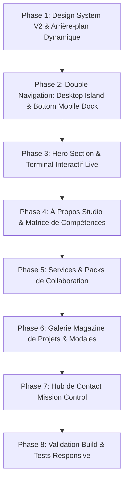

# ⚡ Plan Stratégique V2 : Refonte Radicale UI/UX & Responsive Multi-Écrans (2026)

Ce document présente la stratégie de refonte **V2** pour métamorphoser complètement l'interface utilisateur (**UI**) et l'expérience utilisateur (**UX**) du portfolio de **Jean-Claude Sassou** (`johnnygoldsoft.github.io`).

---

## 🎨 1. Concept Artistique : "Cyber-Sleek & Studio Luxury"

- **Fond Interactif** : Grille cybernétique subtile (*Dot Matrix*) avec lueurs d'aurores dynamiques (*Aurora Mesh Glow*).
- **Hero Dev Studio** : Grand titre cinétique percutant associé à un **Widget Terminal macOS interactif** avec commandes réelles et statistiques live.
- **Navigation Multi-Écrans** :
  - **Desktop** : Îlot flottant semi-transparent avec détection de section.
  - **Mobile (< 768px)** : **Bottom Floating Dock** ergonomique (style application iOS/Android native).
- **Showcase Projets Mode Magazine** : Cartes immersives grand format avec badges technologiques et modales d'étude de cas.
- **Hub de Contact "Mission Control"** : Sélecteur de projet par puces interactives, budget indicatif, copie rapide en 1 clic et Web3Forms.

---

## 🗺️ 2. Roadmap des Phases d'Exécution V2

---

## 📋 3. Détail des Modules & Composants

### 🔹 Module 1 : Arrière-plan Dynamique & Tokens V2
- **Tokens CSS V2** : Dégradés d'aurore, verre dépoli ultra haute définition et bordures néon subtiles.
- **`BackgroundMatrix.jsx`** : Arrière-plan animé avec grille de points réactive.

### 🔹 Module 2 : Double Navigation Adaptative
- **`Navbar.jsx`** : Barre supérieure épurée pour grands écrans.
- **`MobileDock.jsx`** : Barre inférieure flottante tactile pour smartphones avec raccourcis rapides (Accueil, Projets, Contact, Thème).

### 🔹 Module 3 : Hero Section & Terminal Interactif
- **`Header.jsx`** : Typographie cinétique XXL, badge de statut temps réel et dock d'actions rapides.
- **`LiveTerminal.jsx`** : Console de développement interactive simulant les compétences et architectures logicielles.

### 🔹 Module 4 : Bento Studio & Matrice de Compétences
- **`About.jsx`** & **`BentoGrid.jsx`** : Carte d'identité studio, sélecteur de stack par domaine (Mobile Flutter, Web Next.js, Backend Laravel, UI/UX Figma) et horloge locale de Lomé (GMT).

### 🔹 Module 5 : Packs de Services
- **`Services.jsx`** : 6 offres clés en main avec livrables détaillés, engagements de performance et technologies dédiées.

### 🔹 Module 6 : Showcase Projets Mode Magazine
- **`Work.jsx`** : Cartes de projets pleine largeur avec vignettes haute définition, puces technologiques et modale d'étude de cas.

### 🔹 Module 7 : Centre de Contact "Mission Control"
- **`Contact.jsx`** : Formulaire interactif 2 colonnes avec sélection du type de projet, copie d'email en 1 clic et validation Web3Forms.

### 🔹 Module 8 : Footer & SEO
- **`Footer.jsx`** : Signature technique, statut en direct et bouton retour en haut.

---

## 🧪 4. Protocole de Validation Responsive & Tests

- **Mobile (360px — 480px)** : Navigation au pouce via le Bottom Dock, typographie adaptée, zéro débordement horizontal.
- **Tablette (768px — 1024px)** : Grille 2 colonnes aérée et tactile.
- **Desktop (1280px — 1920px+)** : Effets de parallaxe, lueur Spotlight et rendu visuel premium.
- **Build de Production** : Validation `next build` avec un code de sortie `0`.
